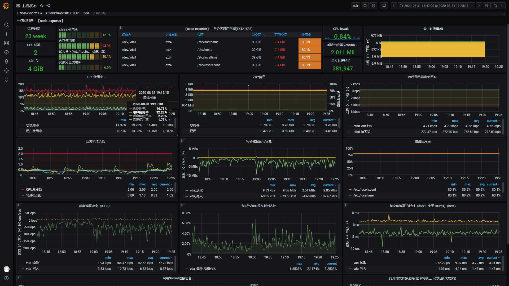
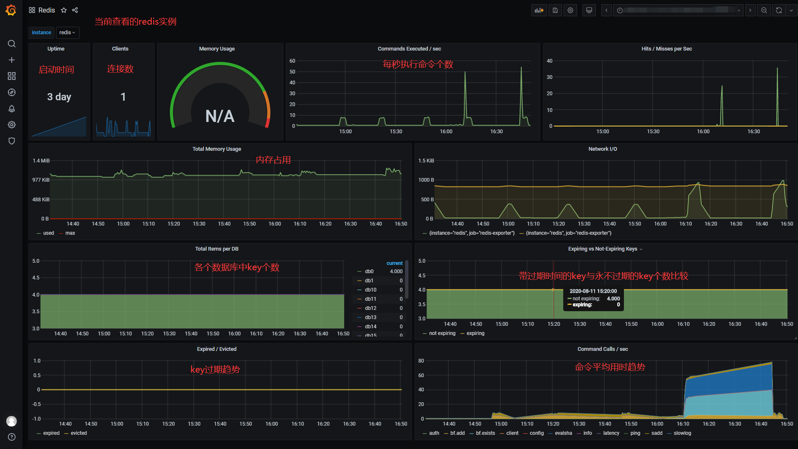
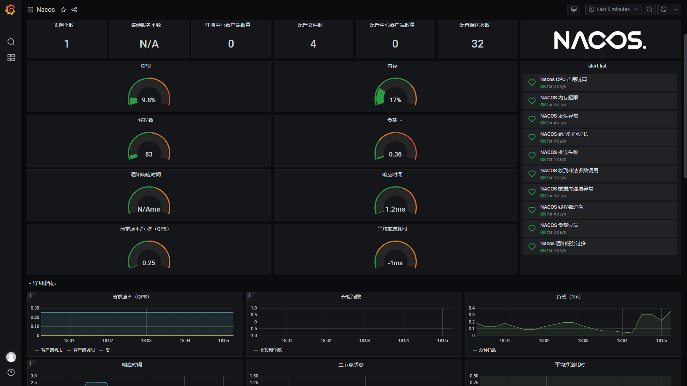
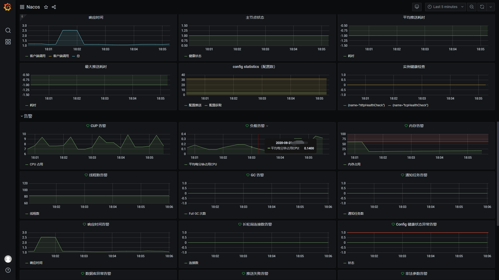
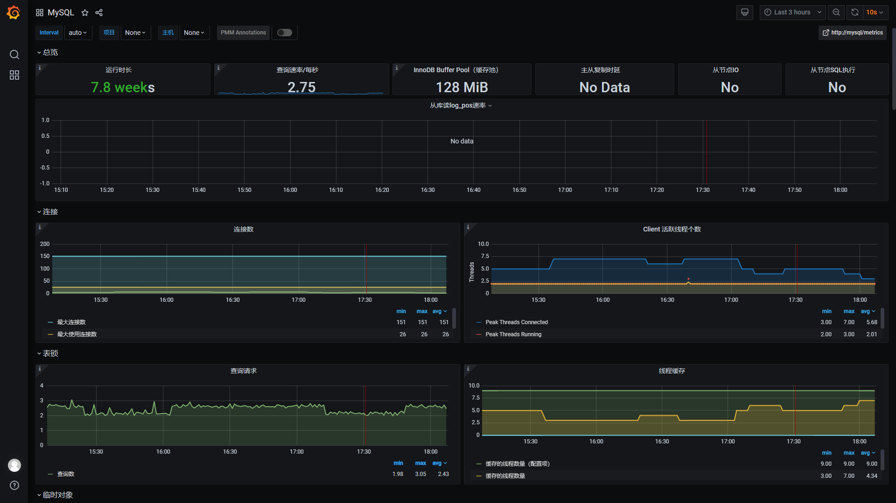
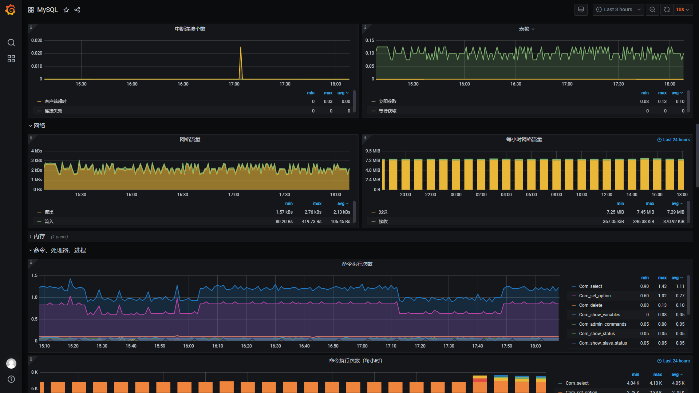
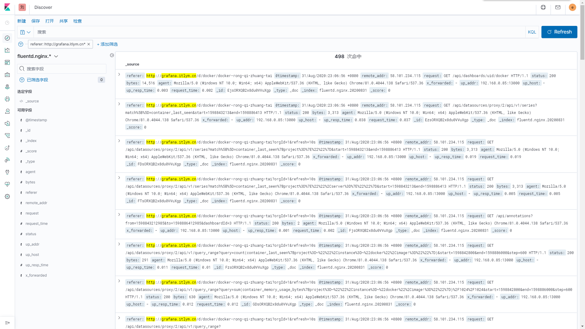

# shoulder-iPaaS

## 简介：

`shoulder-iPaaS` 是一个指导通过 `docker` 快速搭建（**一行命令安装部署**）基础中间件环境的运维指南，与语言无关。

如：
- 玩转云服务器
    - 我想用docker搭建个性化的个人服务，如私人网盘、离线下载器、网络代理等，应该怎么玩
- 搭建常见中间件
    - 我想学习 mysql 或者 redis 或者 kafka 或者 eureka 或者 nacos 等等各种中间件的使用，但我没有中间件的环境，我还要学习如何搭建 redis，本项目带你通过 docker **一行命令安装部署**
    - 高可用方案如何保证、节点之间数据同步是怎么做的
- 企业级监控平台
    - 我已经有了一系列的基础环境，我应该怎么管理这些环境，如何快速实现服务器指标可视化，如CPU占用、内存、网络、存储等？
    - 我有了这些指标，想实现异常指标告警，可以使用哪些技术实现，如何快速落地？
    - 我的业务系统也需要进行一些指标监控，如资源占用、QPS、异常率等
- 企业级基础平台
    - 如何搭建自己的 devOps 平台？如git仓库、cicd服务器、maven仓库等

    
## 如果觉得对您有帮助，请点右上角 "Star" 支持一下吧，谢谢！

## 文档

目录：
- personal-useful-tool
    - 云服务器还可以这么玩：适合个人服务器上部署、玩耍的工具类应用
- mid-ware
    - 快速部署常见的中间件
- dev-ops
    - 开发中有用的工具平台，git、maven 仓库等基础服务私有部署
- monitor
    - 监控平台如何做

具体文档见文件夹内

## 展示

#### 监控

[监控系统预览地址](http://grafana.itlym.cn)（访客账号密码：`shoulder` / `shoulder123`，演示账号仅包含仪表盘查看权限，不能编辑）

#### 日志收集

ELK展示nginx日志演示

查看所有访问 grafana.itlym.cn 的访问日志

查看所有请求时间大于 200ms 的访问日志

## 项目代码地址

| 项目 | 开源地址 | 说明 |
|---|---|---|
| Shoulder Framework | [github](https://github.com/ChinaLym/Shoulder-Framework)、[gitee](https://gitee.com/ChinaLym/shoulder-framework) | 开发框架，在 Spring Boot 基础之上，结合[软件优雅设计与开发最佳实践](http://spec.itlym.cn)，增加常用的功能，任何基于`Spring Boot`/`Spring Cloud`的项目都可以使用。 |
| shoulder-framework-demo | [github](https://github.com/ChinaLym/shoulder-framework-demo)、[gitee](https://gitee.com/ChinaLym/shoulder-framework) | 以简单的例子介绍 `Shoulder Framework` 的使用 |
| shoulder-plugins | [github](https://github.com/ChinaLym/shoulder-plugins)、[gitee](https://gitee.com/ChinaLym/shoulder-plugins) | shoulder 提供的的减少开发工作量的`maven`插件（非必须，如遵循[软件优雅设计与开发最佳实践-国际化开发](http://doc.itlym.cn/specs/base/i18n.html)时推荐希望使用自动生成多语言翻译资源文件的插件减少开发工作量） |
| shoulder-lombok | [github](https://github.com/ChinaLym/shoulder-lombok)、[gitee](https://gitee.com/ChinaLym/shoulder-lombok) | 在`lombok`之上，增加 `@SLog` 注解，用于简化[软件优雅设计与开发最佳实践-错误码与日志](http://spec.itlym.cn/specs/base/errorCode.html) -shoulder 实现的日志框架的使用（非必须） |
| shoulder-lombok-idea-plugin | [github](https://github.com/ChinaLym/lombok-intellij-plugin)、[gitee](https://gitee.com/ChinaLym/lombok-intellij-plugin) | 在 `lombok-idea-plugin`之上，在 IDEA 中增加`@SLog`的编码提示，以更好的使用 `shoulder-lombok`（非必须，使用 shoulder-lombok 时推荐） |
| Shoulder Platform | [github](https://github.com/ChinaLym/Shoulder-Platform)、[gitee](https://gitee.com/ChinaLym/shoulder-Platform) | SaaS 开发平台，提供了基础通用能力，与具体业务无关 |
| Shoulder iPaaS | [github](https://github.com/ChinaLym/shoulder-iPaaS)、[gitee](https://gitee.com/ChinaLym/shoulder-iPaaS) | iPaaS 平台，介绍了常见中间件、监控系统、私有基础平台如何部署 |

## 层次设计

| 层次 | 定位 | 方案 | Shoulder 支持 |
|---|---|---|---|
| 业务应用服务 `SaaS` | 面向用户设计，更应该考虑如何方便用户 | 使用者根据实际业务把握 | `shoulder-framework` 提供了一些常用的能力，以及规约的对接；`shoulder-platform-common` 提供了快速开发一个与 `shoulder-platform` 设计、技术、风格统一的应用服务 |
| 平台对接开发包 `SDK` | 降低使用者调用 `shoulder` 的开发成本和难度 | 以 Spring Boot 自动装配形式提供，包含使用文档和Demo | 提供对接 shoulder-platform的默认实现，使用者也可根据平台api接口文档自行实现 |
| 共性业务层 `aPaaS` | 通用基础功能如认证、注册、授权、通知推送、知识库、错误码查询等 | api网关、web管理平台、用户中心、通知中心 |  |
| 开发脚手架 `工具` | 统一维护共性代码，提供常用能力如异常拦截、错误码、安全加密等，统一管理技术和依赖版本 | `spring boot`、`spring cloud`、`shoulder-framework`、`shoulder-platform-common` 等 | 提供一些常用的功能封装，**可直接用于任何项目** |
| 软件开发设计理论指导 `理论` | 软件开发设计理论指导，主要为了系统的易维护、易扩展、易观测、安全性 | 总结业界开发设计实践经验如 `阿里巴巴Java开发规范` 结合而成，详见[优雅软件设计规范](http://spec.itlym.cn) | shoulder给予了一定的理论指导，但这是**可选的**，不强制使用者必须遵循 |
| **软件平台基础层 `iPaaS`** | 无业务含义的基础中间件，数据库、消息队列、监控中间件、告警中间件等 | MySql、RabbitMQ、Nacos、Zipkin、ElasticSearch、Docker、K8s 等，以 `Docker` 镜像方式提供 | 提供大部分场景的最佳技术方案选型，安装、部署、参数调优方案，**可直接用于任何项目** |
| 硬件基础层 `IaaS` | 硬件支撑，如CPU、内存、网络、存储等 | 依赖云主机厂商，如阿里云、腾讯云、亚马逊云等 | 无，shoulder不干涉该层 |
